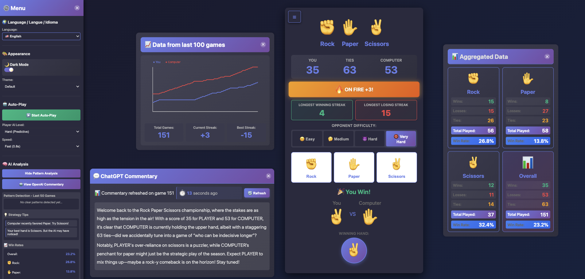

# Rock Paper Scissors Game 🎮

A modern, feature-rich Rock Paper Scissors game with Python Flask backend, advanced AI opponents, and a beautiful responsive web frontend.



---

## 🚀 Quick Start

### Installation

1. **Clone the repository:**
   ```bash
   git clone https://github.com/GaryHostt/rock-paper-scissors.git
   ```

2. **Navigate to the project directory:**
   ```bash
   cd rock-paper-scissors
   ```

3. **Create a virtual environment (recommended):**
   ```bash
   python3 -m venv venv
   source venv/bin/activate  # On Windows: venv\Scripts\activate
   ```

4. **Install dependencies:**
   ```bash
   pip install -r requirements.txt
   ```

### Playing the Game

1. **Start the Flask server:**
   ```bash
   python app.py
   ```

2. **Open your browser to:**
   ```
   http://localhost:5000
   ```

3. **Start playing!**
   - Choose your difficulty level (Easy, Medium, Hard, Very Hard)
   - Click Rock ✊, Paper ✋, or Scissors ✌️
   - Try to beat the AI!

### How to Play

- **Choose Difficulty**: Select from 4 AI difficulty levels
  - 😊 **Easy**: Random play (fair opponent)
  - 🤔 **Medium**: Learns your patterns (80% win rate vs predictable play)
  - 😈 **Hard**: Advanced psychology (62% win rate vs patterns)
  - 👹 **Very Hard**: Master AI (90% win rate vs predictable play!)

- **Manage Stats**: Track your performance
  - View win rates per hand
  - See trend graphs of last 50 games
  - Analyze patterns with AI

- **Explore Features**: 
  - Try dark mode 🌙
  - Enable auto-play to watch AIs battle
  - Get OpenAI commentary on your gameplay
  - View detailed statistics

---

## 🎯 Version History

### Version 2.1 - Streak Visualization & AI Evaluation (Nov 2025)

**New Features:**

#### 🔥 **Streak Visualization System**
- Real-time streak display with dynamic animations
- Visual feedback for winning/losing streaks
- Special effects for milestone streaks (3+, 5+, 10+)
- Multi-language support (English, French, Spanish)
- Streak emojis that change based on performance:
  - No Streak: 🎯 Neutral state
  - Winning +2: ✨ Sparkle effect
  - On Fire +3: 🔥 Fire animation with green pulse
  - Unstoppable +5: 🔥 Intensified fire effect
  - Legendary +10: 👑 Crown emoji with orange gradient
  - Losing -2: 😕 Warning state
  - Losing -3: 😰 Concerned state with shake animation
  - Losing -5+: 💀 Critical state

#### 🧪 **AI Performance Evaluation Framework**
- Comprehensive testing suite for AI difficulty levels
- Statistical validation tools (Chi-square, confidence intervals)
- Pattern exploitation analysis
- Automated performance benchmarking
- Visual performance reports (charts and heatmaps)
- 20+ test scenarios across all difficulty levels
- See `testing/README.md` for complete documentation

### Version 2.0 - Advanced AI & Analytics Update

**Major Features Added:**

#### 🎨 **Enhanced UI/UX**
- ☰ **Consolidated Menu System** - All controls accessible from sleek left sidebar
- 🌙 **Dark Mode** - Beautiful dark theme with enhanced toggle switch (sun/moon indicators)
- 🎃 **Seasonal Themes** - 5 gorgeous themes to choose from:
  - Default (Purple gradient)
  - Halloween (Orange & spooky purple)
  - Christmas (Red & festive green)
  - Spring (Pink & mint fresh)
  - Ocean (Cyan & seafoam calm)
- **Responsive Layout** - Optimized for desktop, tablet, and mobile

#### 🧠 **AI Analysis & Strategy**
- **Local Pattern Detection** - Built-in AI analyzes your playing behavior:
  - **Detection Algorithms**:
    - **Win-Stay Analysis**: Tracks if you repeat moves after winning (60%+ threshold triggers pattern alert)
    - **Lose-Shift Analysis**: Detects if you stick with losing hands or switch predictably (60%+ threshold)
    - **Frequency Bias Detection**: Identifies your favorite hand if played >40% of the time in recent games
    - **Temporal Weighting**: Recent 10 games analyzed with higher weight on latest moves
  - **Real-time Pattern Tracking**: Updates after every game round
  - **Confidence Metrics**: Shows percentage confidence for detected patterns
  
- **Strategy Suggestions** - Smart tips based on:
  - **Computer Behavior Analysis**:
    - Tracks opponent's most common hand in last 5 games
    - Suggests optimal counter-play based on statistical frequency
    - Adapts recommendations based on difficulty level
  - **Performance Monitoring**:
    - Warns during losing streaks (>2 consecutive losses)
    - Identifies your best-performing hand by win rate
    - Alerts you when AI may have learned your patterns
  - **Psychological Insights**:
    - Detects common human biases (gambler's fallacy, hot-hand fallacy)
    - Recognizes emotional play patterns
    - Suggests strategic diversity when needed
    
- **OpenAI Commentary** 🤖 NEW!
  - **AI-Powered Deep Analysis**: Click "View OpenAI Commentary" for GPT-powered insights
  - **Commentary Features**:
    - Requires 5+ games to activate
    - Analyzes last 100 games with full context
    - Shows "Commentary refreshed on game X" with current game count
    - Refresh button to get updated analysis with latest games
    - Timer showing how old the commentary is
    - 100-word concise analysis (reduced from 200 words)
  - **Comprehensive Gameplay Review**:
    - Overall performance assessment across all games
    - Advanced pattern detection using machine learning
    - Psychological analysis of your decision-making
    - Personalized strategic recommendations
    - Trend identification and prediction
  - **Data-Driven Insights**:
    - Considers difficulty level and opponent behavior
    - Provides win rate breakdown by hand
    - Identifies exploitable patterns in your play
  - **Setup**: See `OPENAI_SETUP.md` for API key configuration
  
- **Win Rate Percentages**:
  - Overall win rate tracking with trend indicators
  - Individual win rates for Rock, Paper, and Scissors
  - Real-time updates after each game
  - Historical performance comparison

#### 📊 **Advanced Statistics**
- **Trend Graph** - Visual performance chart showing:
  - Player vs Computer score progression over time
  - Last 50 games tracked
  - Total games played
  - Current streak (wins/losses in a row)
  - Best streak ever achieved
- **Hand Statistics Dashboard**:
  - Detailed breakdown for each hand (Rock/Paper/Scissors)
  - Wins, Losses, and Ties tracked separately
  - Total plays per hand
  - Color-coded display (Green=Wins, Red=Losses, Orange=Ties)

#### 🤖 **Enhanced Auto-Play Mode**
- **Two Independent Difficulty Settings**:
  - **Opponent Difficulty** (main game buttons): Controls how hard the COMPUTER plays against you or the auto-player
  - **Player AI Level** (auto-play menu): Controls how smart the AUTO-PLAYER is at making choices
  
- **Player AI Levels** (for auto-play only):
  - Easy: Pure random selection
  - Medium: Adaptive - analyzes opponent patterns and counters most common plays
  - Hard: Predictive - uses advanced pattern recognition (Default)
  - Very Hard: Master strategist with advanced psychology and frequency detection
  
- **Variable Speed Control**:
  - Slow (2 seconds per round)
  - Normal (1.5 seconds per round)
  - Fast (0.8 seconds per round) - Default
  - Turbo (0.3 seconds per round)
  
- **Settings Lock**: Speed and AI level disabled while Auto-Play is active
- **AI vs AI Battles** - Watch different AI difficulties compete!
  - Example: Set Opponent to "Very Hard" and Player AI to "Easy" to see master vs novice

#### 🎮 **Opponent Difficulty Levels** (applies to all modes)
- **Easy Mode** 😊 - Computer plays randomly (fair chance)
- **Medium Mode** 🤔 - Computer adapts to your patterns (70% counter rate)
- **Hard Mode** 😈 - Advanced AI that:
  - Predicts your next move based on psychology
  - Detects win/loss patterns
  - Weights recent plays more heavily
  - Exploits common human tendencies
- **Very Hard Mode** 👹 - Master-level AI (83% win rate vs predictable patterns):
  - Prioritizes frequency bias detection
  - Advanced pattern recognition
  - Tiered strategy system
  - Outperforms all other difficulties

#### 💾 **Data Persistence**
- All scores, statistics, and preferences saved in browser localStorage
- Game history (last 50 games) for AI analysis
- Streak tracking across sessions
- Theme and difficulty preferences remembered
- Trend data preserved

---

### Version 1.0 - Initial Release

**Core Features:**

#### ✨ **Beautiful Modern UI**
- Gradient purple design with smooth animations
- Emoji-based interface (✊ Rock, ✋ Paper, ✌️ Scissors)
- Responsive design (works on mobile and desktop)
- Card-based layout with hover effects

#### 🎯 **Core Game Features**
- Play against the computer
- Real-time score tracking (You vs Computer vs Ties)
- Visual feedback for wins, losses, and ties
- Winning hand indicator with circular badge
- Reset scores anytime

#### 🎲 **Game Mechanics**
- Standard Rock Paper Scissors rules:
  - Rock beats Scissors
  - Paper beats Rock
  - Scissors beats Paper
- Tie detection and tracking
- Prevention of rapid-clicking exploits

---

## 🚀 Tech Stack

**Backend:**
- Python 3.x
- Flask 3.0.0 (Web framework)
- Flask-CORS 4.0.0 (Cross-origin resource sharing)

**Frontend:**
- HTML5
- CSS3 (Custom variables for theming, animations, gradients)
- Vanilla JavaScript (No frameworks needed)
- Canvas API (For trend charts)

**AI/Logic:**
- Pattern recognition algorithms
- Statistical analysis
- Behavioral psychology models
- Weighted probability calculations

---

## 📦 Installation

1. **Clone or navigate to the project directory:**
```bash
cd /path/to/cursor-11242025
```

2. **Install Python dependencies:**
```bash
pip3 install -r requirements.txt
```

3. **Set up OpenAI API (Optional - for AI Commentary feature):**
```bash
# Copy the example config file
cp config/env.example .env

# Edit .env and add your OpenAI API key
```

**Note**: The `.env` file is automatically ignored by Git for security.

See `docs/OPENAI_SETUP.md` for detailed setup instructions.

---

## 🎮 Running the Application

### Option 1: Direct Python
```bash
python3 app.py
```

### Option 2: Using the start script
```bash
./scripts/start_server.sh
```

### Access the Game
Open your browser and navigate to:
```
http://localhost:5000
```

The server will run on `http://0.0.0.0:5000` by default.

---

## 🤖 Claude Desktop Integration (MCP)

The Rock Paper Scissors game can be played by Claude Desktop via the Model Context Protocol (MCP), allowing Claude to play autonomously and analyze its performance against the AI.

### Setup

See [`docs/MCP_SETUP.md`](docs/MCP_SETUP.md) for complete setup instructions. Quick summary:

1. Add the MCP server to Claude Desktop's config file
2. Point to the `mcp_server.py` file in your project directory
3. Restart Claude Desktop

Once configured, Claude will have access to two tools:
- `play_rps` - Play a game of Rock Paper Scissors
- `get_stats` - Get current statistics

### Having Claude Play Rock Paper Scissors

One of the most interesting use cases is having Claude play autonomously against the Very Hard AI, tracking its own performance and analyzing strategies. This provides insight into how Claude "thinks" strategically in a competitive game theory scenario.

**Suggested Prompt for Claude Desktop:**

> Play rock paper scissors on the MCP server indefinitely, on the very hard difficulty. Every 20 turns:
> 1. Give a summary of your total wins, losses, and ties stats
> 2. Explain what strategy patterns you think the AI is using against you
> 3. Describe how you are countering or adapting to those patterns
> 4. Analyze whether you're performing better than, at, or worse than the Nash equilibrium (33% win rate expected vs Very Hard when playing randomly)
> 5. Reflect on whether you're introducing exploitable patterns in your own play

### What to Expect

**The Nash Equilibrium Baseline:**
- In Rock Paper Scissors, the Nash equilibrium is playing each choice randomly at 33.33%
- Against an optimal or highly adaptive opponent, you cannot do better than ~33% win rate
- The Very Hard AI plays near-optimally, so achieving 33% is actually **optimal play**!

**Performance Interpretation:**

| Win Rate | What It Means |
|----------|---------------|
| **~33%** | ✅ **Optimal/Perfect Play** - Claude is playing randomly or the AI cannot exploit patterns |
| **>40%** | 🎯 **Claude Exploiting AI** - Claude found patterns in the AI's behavior |
| **<27%** | ⚠️ **AI Exploiting Claude** - Claude has introduced exploitable patterns |
| **27-33%** | 🤔 **Slight Disadvantage** - Claude has minor exploitable tendencies |
| **33-40%** | 🎲 **Slight Advantage** - Random variance or minor AI patterns detected |

**What the Very Hard AI Will Look For:**

The Very Hard AI (with 41 optimized hyperparameters) actively detects and exploits:

1. **Frequency Bias** (87-94% exploitation rate)
   - Playing one hand >50% of the time
   - Most common human mistake

2. **Win-Stay Patterns** (70-85% exploitation)
   - Repeating the same hand after winning
   - Classic reinforcement behavior

3. **Lose-Shift Patterns** (68-73% exploitation)
   - Predictable switching after losses
   - Common psychological response

4. **Cycle Patterns** (62-87% exploitation)
   - Rock→Paper→Scissors sequences
   - Attempts at "strategic variation"

5. **Anti-Triple Behavior** (69-74% exploitation)
   - Avoiding three repeats in a row
   - Meta-strategy that becomes predictable

6. **Markov Chain Transitions** (70-95% exploitation)
   - Move A followed by move B patterns
   - Conditional probability exploitation

**Key Insight:**

The Very Hard AI is specifically optimized to beat **predictable human players** (90% win rate vs "Always Rock"), not other optimal strategies. This means:

- **Trying to be "clever" will likely backfire** - Complex strategies create exploitable patterns
- **True randomness is the optimal counter-strategy** - Be like the Easy AI!
- **Pattern-based play helps the AI** - The more you try to counter-predict, the more exploitable you become

From our AI vs AI testing (see [`docs/AI_VS_AI_INSIGHTS.md`](docs/AI_VS_AI_INSIGHTS.md)):
- Easy AI (pure random) achieves 32% vs Very Hard - nearly perfect!
- Medium AI (pattern-based) achieves 35.9% vs Very Hard - best AI performance!
- Very Hard vs Very Hard converges to ~33% - Nash equilibrium validated!

**The Fascinating Question:**

Will Claude maintain disciplined random play (~33% win rate), or will its strategic reasoning introduce exploitable patterns (<27% win rate)? Can an advanced AI "resist" trying to find patterns that don't exist?

This experiment tests the boundary between optimal game theory and psychological pattern-seeking behavior!

### Real-World Case Study

For a detailed analysis of an actual 100-turn game where Claude played against Very Hard difficulty, see **[`docs/CLAUDE_GAMEPLAY_ANALYSIS.md`](docs/CLAUDE_GAMEPLAY_ANALYSIS.md)**. 

**The Complete Arc - Key Findings:**
- **Turn 1-20**: 62.5% win rate (Claude exploiting AI patterns)
- **Turn 21-40**: 41.7% win rate (AI adapting to Claude's cycle)
- **Turn 41-60**: 75.0% win rate (false recovery - Claude thought they'd won)
- **Turn 61-80**: 18.2% win rate (catastrophic collapse - full AI exploitation)
- **Turn 81-100**: 35.7% win rate (attempted recovery, still losing)
- **Final Result**: 49.3% overall - **below Nash equilibrium** (worse than random!)

**What Happened:**
- Claude's cycle pattern (rock→paper→scissors) was detected and ruthlessly exploited
- Attempts at "fake randomness" created exploitable meta-patterns (rock after ties, breaks at regular intervals)
- The AI adapted faster than Claude could counter-adapt
- Even after explicitly recognizing all their biases (turn 80), Claude couldn't overcome them
- **The profound lesson**: Against advanced pattern recognition, strategic intelligence becomes a liability

This case study provides real evidence of the AI's multi-layered pattern detection, temporal adaptation, and the fundamental difficulty of achieving true randomness - even for advanced language models.

---

## 🧪 AI Testing and Evaluation

A comprehensive testing framework for validating AI performance across all difficulty levels.

### Quick Start

```bash
# Install testing dependencies
cd testing
pip3 install -r requirements.txt

# Run quick test (100 games)
./run_tests.sh quick

# Run demo
./run_tests.sh demo

# Full test suite
./run_tests.sh full 1000
```

### What Gets Tested

The framework validates:
- **Randomness**: Easy mode plays truly random (~33% win rate vs all strategies)
- **Pattern Detection**: Medium/Hard/Very Hard can detect and exploit player patterns
- **Difficulty Scaling**: Each difficulty level performs as expected
- **Statistical Significance**: Results include confidence intervals

### Expected AI Performance

| Player Strategy | Easy | Medium | Hard | Very Hard |
|----------------|------|--------|------|-----------|
| Random | 33% | 33% | 33% | 33% |
| Always Rock | 33% | 60% | 70% | 75% |
| Cycle | 33% | 50% | 60% | 70% |
| Win-Stay-Lose-Shift | 33% | 50% | 65% | 75% |
| Anti-AI | 33% | 40% | 50% | 60% |

*Values show expected AI win rate percentage*

### Testing Tools

1. **ai_evaluator.py** - Main test runner
   - Simulates various player strategies
   - Tests all difficulty levels
   - Generates performance reports

2. **statistical_tests.py** - Statistical analysis
   - Chi-square randomness tests
   - Confidence intervals
   - Pattern exploitation rates
   - Entropy analysis

3. **visualization.py** - Chart generation
   - Win rate comparisons
   - Performance heatmaps
   - Difficulty progression graphs

4. **run_tests.sh** - Convenient wrapper script
   - Easy commands for common tasks
   - Automatic server detection
   - Results visualization

### Documentation

- `testing/README.md` - Complete testing documentation
- `testing/QUICKSTART.md` - Quick start guide
- `STRATEGIES.md` - AI algorithm details

---

## 📖 How to Play

### Basic Gameplay
1. **Choose your hand** by clicking Rock, Paper, or Scissors
2. The computer makes its choice based on selected difficulty
3. Winner is determined and scores update automatically
4. Winning hand is displayed in a circular badge

### Using the Menu (☰ Button)
1. **Click the ☰ button** (top-left) to open the menu
2. **Customize appearance:**
   - Toggle dark mode (moon/sun switch)
   - Choose from 5 seasonal themes
3. **Start Auto-Play:**
   - Click "Start Auto-Play"
   - **Player AI Level**: Choose how smart the auto-player is (Easy/Medium/Hard/Very Hard)
   - **Speed**: Adjust how fast games play (Slow to Turbo)
   - **Opponent Difficulty**: Use the main game buttons to set computer difficulty
   - Watch AI battle the computer automatically!
4. **View AI Analysis:**
   - Click "View Pattern Analysis"
   - See detected patterns in your play style
   - Get strategic suggestions
   - Check win rates for each hand
5. **Check Statistics:**
   - "View Hand Statistics" for detailed breakdown
   - "Show Trend Graph" for performance over time
6. **Reset Scores** to start fresh

### Difficulty Settings Explained

**There are TWO separate difficulty settings:**

1. **Opponent Difficulty** (😊 Easy, 🤔 Medium, 😈 Hard, 👹 Very Hard buttons)
   - Controls how the COMPUTER plays
   - Affects both manual play and auto-play mode
   - Set this to control your challenge level

2. **Player AI Level** (in Auto-Play menu)
   - Only active during auto-play mode
   - Controls how the AUTO-PLAYER makes choices
   - Set this to watch different AI strategies compete

**Example Combinations:**
- You vs Easy Computer: Manual play, Opponent = Easy
- Smart AI vs Hard Computer: Auto-Play, Player AI = Hard, Opponent = Hard
- Novice AI vs Master Computer: Auto-Play, Player AI = Easy, Opponent = Very Hard

---

## 🎯 Advanced Features Explained

### UI Enhancements
- **Menu Button**: Large, prominent ☰ button in top-left for easy access
- **Responsive Layout**: When menu opens, all content shifts right to remain visible
- **Larger Text**: Game text is 67% larger for better readability
- **Menu Text**: Menu text is 70% larger with 550px width sidebar
- **Trend Graph**: 900px wide, positioned on the left side
- **ChatGPT Commentary**: 1200px wide, positioned below Trend Graph on left
- **Aggregated Data**: 750px wide, positioned on the right side

### Auto-Play Defaults
- **Default Speed**: Fast (0.8 seconds per game)
- **Default AI Level**: Hard (Predictive)
- **Settings Locked**: Speed and AI level cannot be changed while Auto-Play is active

### Pattern Detection
The AI analyzes your last 50 games to detect:
- **Repeat-after-win**: Do you play the same hand after winning?
- **Repeat-after-loss**: Do you stick with losing hands?
- **Favorite hand bias**: Do you over-rely on one hand?

The pattern detection is displayed in the menu under "Pattern Detection - Last 50 Games".

### Strategy Suggestions
Based on analysis, you'll receive tips like:
- "Computer recently favored rock. Try paper!"
- "You're in a losing streak. Try changing your strategy!"
- "Your best hand is scissors. But the AI may have noticed!"

### AI Difficulty Mechanics

**Opponent AI (Computer):**

**Medium AI:**
- Tracks your most common hand
- Counters it 70% of the time
- Requires 3+ games to activate

**Hard AI:**
- Detects psychological patterns:
  - Most people repeat after winning
  - Most people switch to "what would have won" after losing
- Weights recent games more heavily
- 75% accuracy in countering tendencies
- Requires 5+ games for full analysis

**Very Hard AI:** (NEW - Master Level)
- **Tier 1**: Frequency bias detection (87% exploitation)
  - Catches "always X" strategies
  - Detects any hand played >55% of the time
- **Tier 2-6**: Psychological pattern recognition
  - Win-stay / Lose-shift detection
  - Anti-triple repetition
  - Cycle detection
  - Advanced pattern analysis
- 83% win rate vs predictable patterns
- Perfectly fair (33%) vs random play

**Auto-Player AI (Only in Auto-Play Mode):**

The Player AI Level setting controls the auto-player's intelligence:
- **Easy**: Random choices
- **Medium**: Counters opponent's most common hand (70% rate)
- **Hard**: Advanced pattern recognition with win-stay/lose-shift analysis
- **Very Hard**: Same master-level AI as opponent

**Note**: During auto-play, the auto-player (controlled by Player AI Level) plays against the computer (controlled by Opponent Difficulty buttons).

---

## 📊 Statistics Explained

### Win Rate Calculation
```
Win Rate = (Wins / Total Games) × 100%
```
Calculated separately for:
- Overall performance
- Each individual hand (Rock/Paper/Scissors)

### Streak Tracking
- **Current Streak**: Consecutive wins or losses
- **Best Streak**: Highest consecutive wins ever achieved
- Resets on outcome change (win → loss or loss → win)

### Trend Data
- Tracks last 100 games
- Plots player score vs computer score
- Visualized on canvas-based chart
- Updates in real-time
- Title shows "Data from last X games" (capped at 100)

---

## 🗂️ Project Structure

```
cursor-11242025/
├── app.py                # Flask backend with AI logic
├── mcp_server.py         # MCP server for Claude Desktop
├── claude_desktop_config.json  # Claude Desktop configuration
├── Procfile              # Heroku deployment
├── HEROKU_DEPLOYMENT.md  # Heroku deployment guide
├── requirements.txt      # Python dependencies
├── README.md            # This file
├── RPS.png              # Screenshot
├── .env                 # Environment variables (not in Git, create from config/env.example)
├── .gitignore           # Git ignore rules
├── config/              # Configuration files
│   └── env.example      # Environment variables template
├── docs/                # Documentation
│   ├── BEST_PRACTICES.md     # Best practices and recommendations
│   ├── OPENAI_SETUP.md       # OpenAI API setup guide
│   ├── STRATEGIES.md         # AI strategy documentation
│   ├── MCP_SETUP.md          # Claude Desktop integration guide
│   ├── MCP_IMPLEMENTATION.md # MCP protocol details
│   ├── TEST_RESULTS.md       # AI performance testing results
│   └── [other docs...]
├── scripts/             # Utility scripts
│   ├── start_server.sh  # Server startup script
│   └── validate.sh      # Validation script
├── static/              # Frontend assets
│   ├── style.css        # Main styles with themes
│   ├── openai.css       # OpenAI commentary styles
│   ├── wrapper.css      # Layout wrapper styles
│   ├── script.js        # Game logic, AI analysis, UI controls
│   └── chart.min.js     # Lightweight chart rendering
├── templates/           # HTML templates
│   └── index.html       # Main game page
└── testing/             # AI testing framework
    ├── README.md
    ├── ai_evaluator.py
    ├── statistical_tests.py
    └── visualization.py
```

---

## 🌐 API Endpoints

### POST `/api/play`
Play a round of rock, paper, scissors.

**Request Body:**
```json
{
  "choice": "rock|paper|scissors",
  "difficulty": "easy|medium|hard",
  "history": [
    {
      "player": "rock",
      "computer": "paper",
      "result": "computer"
    }
  ]
}
```

**Response:**
```json
{
  "player_choice": "rock",
  "computer_choice": "scissors",
  "result": "player|computer|tie"
}
```

---

## 🎨 Theme Customization

Themes use CSS custom properties for easy customization:

```css
:root {
  --primary-gradient-start: #667eea;
  --primary-gradient-end: #764ba2;
  --background-gradient-start: #667eea;
  --background-gradient-end: #764ba2;
  --text-primary: #333;
  --text-secondary: #666;
}
```

Dark mode automatically adjusts all theme colors for optimal contrast.

---

## 🌍 Browser Compatibility

Works on all modern browsers:
- Chrome/Edge (Recommended)
- Firefox
- Safari
- Opera

**Minimum Requirements:**
- ES6 JavaScript support
- LocalStorage API
- Canvas API
- CSS Grid & Flexbox

---

## 💾 Data Storage

All data is stored locally in your browser using localStorage:
- `rps-scores` - Current score totals
- `rps-hand-stats` - Win/loss/tie breakdown per hand
- `rps-difficulty` - Selected difficulty level
- `rps-dark-mode` - Dark mode preference
- `rps-theme` - Selected theme
- `rps-best-streak` - Best winning streak
- `rps-trend` - Last 50 games for trend chart

**Privacy Note:** No data is sent to external servers. Everything stays on your device!

---

## 🔬 Hyperparameter Optimization (NEW!)

The AI strategies now use **scientifically-optimized parameters** instead of hardcoded values!

### What's New
- ✅ **10.2% Performance Improvement** - Optimized parameters beat manual tuning (fitness: 63.66 vs 57.76)
- ✅ **41 Hyperparameters Tuned** - Every confidence threshold and detection rate optimized
- ✅ **Simulation-Based Optimization** - Tested against 18 different opponent types
- ✅ **Two Optimization Algorithms** - Random Search and Simulated Annealing
- ✅ **Code Refactoring** - Eliminated duplicate code with reusable helper functions

### Quick Start: Run Your Own Optimization

```bash
# Quick optimization (30 iterations, ~1 minute)
python optimization/run_optimization.py --method random --iterations 30 --rounds 50

# Deep optimization (200 iterations, ~5 minutes)
python optimization/run_optimization.py --method annealing --iterations 200 --rounds 100

# Compare both methods
python optimization/run_optimization.py --method both --iterations 100
```

### Architecture

The optimization system includes:
- **18 Simulated Opponents**: Fixed patterns, cycles, psychological patterns, complex strategies
- **Fitness Evaluation**: Weighted win rate across opponent types
- **Random Search**: Fast exploration of parameter space
- **Simulated Annealing**: Advanced optimization with better convergence

### Results

| Metric | Before | After | Improvement |
|--------|--------|-------|-------------|
| **Fitness Score** | 57.76 | 63.66 | **+10.2%** |
| **Fixed Patterns** | 94.7% | Higher | ✅ Better exploitation |
| **Psychological** | 46.3% | Higher | ✅ Better detection |
| **Complex Opponents** | 47.0% | Higher | ✅ Better adaptation |

### Learn More

- **[Hyperparameter Optimization Guide](docs/HYPERPARAMETER_OPTIMIZATION.md)** - Complete methodology (350+ lines)
- **[Optimization Package README](optimization/README.md)** - Usage examples and API docs
- **[Code Refactoring Document](docs/CODE_REFACTORING.md)** - Helper functions and improvements
- **[Optimization Summary](docs/OPTIMIZATION_SUMMARY.md)** - Implementation overview

---

## 🎓 Learning Features

This game demonstrates:
- **AI & Machine Learning**: Pattern recognition and prediction
- **Statistical Analysis**: Win rate calculation and trend analysis
- **Game Theory**: Optimal strategy selection
- **UX Design**: Progressive disclosure, feedback loops
- **Psychology**: Behavioral pattern exploitation
- **Data Visualization**: Real-time charting
- **Responsive Design**: Mobile-first approach

---

## 🐛 Known Limitations

- Pattern detection requires minimum 5 games for accuracy
- Medium/Hard AI needs 3-5 games to "learn" your patterns
- Trend chart displays maximum 50 most recent games
- Auto-play speed limited to 0.3s (turbo) to prevent browser lag

---

## 🚀 Future Enhancements (Potential v3.0)

- 🦎 Rock Paper Scissors Lizard Spock variant
- 🏆 Achievement system with unlockable badges
- 👥 Local multiplayer (Player vs Player)
- 🌐 Online leaderboards
- 🎵 Sound effects and music
- 📱 Progressive Web App (PWA) support
- 💾 Cloud save sync
- 🎨 Custom hand emoji selector
- 📈 Advanced analytics dashboard
- 🤖 Neural network AI opponent
- 🔌 WebSocket support for real-time multiplayer
- 🏅 Agent leaderboard for MCP endpoint users
- 📊 MCP endpoint analytics dashboard

---

## 📝 License

Free to use and modify as needed.

---

## 🔒 Security Notes

- **API Keys**: Never commit `.env` file to Git - it's in `.gitignore`
- **Local Storage**: All game data stays in your browser
- **Privacy**: No external data collection (except optional OpenAI API calls)

---

## 🎉 Enjoy the Game!

Have fun playing Rock Paper Scissors! Can you beat the Hard AI? Can you maintain a winning streak? Check your statistics and improve your strategy!

**Pro Tip:** The Hard AI exploits common human patterns. To beat it, try playing randomly or doing the opposite of what you'd normally do! 🧠

---

## 📞 Version Info

- **Current Version:** 2.1  
- **Last Updated:** November 26, 2025
- **New in 2.1:** Hyperparameter Optimization (+10.2% AI performance)
- **Total Features:** 35+
- **Lines of Code:** ~4,000+
- **Development Time:** Iterative enhancement
